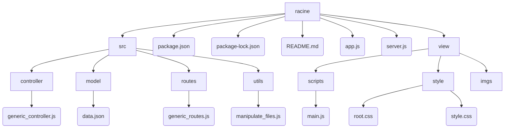

Totify
===
Plateforme centrale de gestion et d'écoute de musique
---

> Application centralisant toute la musique de l'utilisateur en provenance d'autres plateformes, ainsi que la musique importée localement.

### Auteur
Diane (Mogw4i)

<br>

# Table des matières
1. [Description](#description)
    1. [Technologies](#technologies)
        1. [Langages](#langages)
        2. [Modules](#modules)
    2. [Fonctionnement](#fonctionnement)
        1. [Projet](#projet)
        2. [Installation](#installation)
        3. [Utilisation](#utilisation-(interface))
2. [Contenu](#contenu)
    1. [Organigramme](#organigramme-du-projet)
    1. [Contenu détaillé](#contenu-détaillé)

<br>
<hr>
<br>

# Description

## Technologies
### **Langages**
|Langage|Bibliothèque(s)|Plateforme logicielle|
|:---|:----|:----|
| JavaScript | jQuery | Node.js |
| HTML |
| CSS |
### **Modules**
|Module|Version|Utilisation|
|----|----|----|
| express | 4.18.2 | |
| fs | 0.0.1-security | |
| body-parser | 1.20.1 | |
| cors | 2.8.5 | |

// à remplir

## Fonctionnement

### **Projet**
> **Totify** est une application permettant de gérer et d'écouter ses albums provenant de diverses plateformes (de streaming, d'e-commerce), sur une seule application les centralisant toutes. <br>
> Application **client-serveur**, c'est-à-dire consistant en une partie front et une partie back distinctes. <br>
* La partie **front** est l'interface client permettant de gérer ses albums de musique, en les modifiant, les supprimant, en en ajoutant...
* La partie **back** consiste en une API type traitant des requêtes envoyées par la partie client. L'API va traiter les requêtes en appliquant des actions de type CRUD à la base de données.

### **Installation**
1. Vérifier que **Node.js** est installé en entrant la commande suivante dans un terminal (situé dans le dossier) <br>
```
node -v
```
2. Lancer **l'API** back-end
```
npm start
```
3. Ouvrir le dashboard : **index.html**

### Utilisation (interface)
// A remplir 

<br>

# Contenu

## Organigramme du projet

<br>



<br>

## Contenu détaillé

### /
| Fichier | Description |
|---|---|
|**app.js**|Point d'entrée de l'application|
|**server.js**|Support de lancement de l'application|
|package.json|Description technique de l'application

### /src
| Dossier | Fichier | Description |
|---|---|---|
| /controller | **generic_controller.js** | Fonctions du **CRUD** (Create, Read, Update) pour les requêtes |
| /model | **data.json** | Jeu de données de l'application : le JSON contient 3 tableaux : un pour les albums accessibles via des plateformes nécessitant un abonnement (**membership**), un pour la musique importée par l'utilisateur (**local**), un pour les albums achetés sur des plateformes spécifies. |
| /routes | **generic_routes** | Routes **dynamiques** pour les requêtes. Verbes utilisés : **Post**, **Get**, **Put** et **Delete**
| /utils | **manipulate_files.js** | Fichier contenant toutes les **fonctions** réutilisables du controller

### /view
| Dossier | Fichier | Description |
|---|---|---|
|| **index.html** | Accueil de l'**interface** client |
| /scripts |**main.js**| Fichier contenant toutes les **fonctions** de traitement des requêtes côté client <=> lien avec l'API back-end |
| /style | - **root.css** <br> - **style.css** | **Feuilles de style** de l'interface client <br> __root.css__ contient toute la base du design (couleurs...) et le design des objets réutilisables (boutons, menus...) ainsi que des parties du site récurrentes (footer, nav...) ; __style.css__ contient la mise en page globale |

Le dossier **/imgs** contient les images affichées sur le site.
