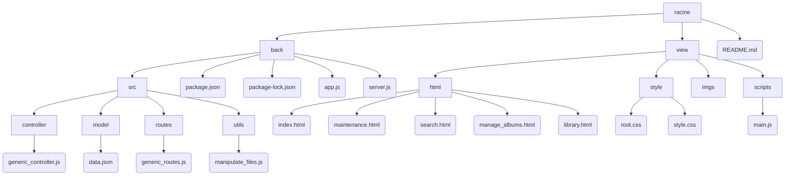

Totify
===
Plateforme centrale de gestion et d'écoute de musique
---

> Application centralisant toute la musique de l'utilisateur en provenance d'autres plateformes, ainsi que la musique importée localement.

> Version : **1.0 beta**

### Auteur
Diane (MogwaiRGod)

<br>

# Table des matières
1. [Description](#description)
    1. [Technologies](#technologies)
        1. [Langages](#langages)
        2. [Modules](#modules)
    2. [Fonctionnement](#fonctionnement)
        1. [Projet](#projet)
        2. [Installation](#installation)
2. [Contenu](#contenu)
    1. [Organigramme](#organigramme-du-projet)
    2. [Contenu détaillé](#contenu-détaillé)
3. [Utilisation](#utilisation)
    1. [Back](#partie-back)
    2. [Front](#partie-front)
4. [Débogage](#débogage)


<br>
<hr>
<br>

# Description

## Technologies
### **Langages**
|Langage|Bibliothèque(s)|Plateforme logicielle|
|:---|:----|:----|
| JavaScript | jQuery | Node.js |
| HTML |
| CSS |

### **Modules**

| Module | Version | Utilisation |
|----|----|----|
| express | 4.18.2 | Module contenant des fonctionnalités pour les reqûetes HTTP => contient des fonctions telles que get(), use()... |
| fs | 0.0.1-security | Module permettant de manipuler des fichiers |
| body-parser | 1.20.1 | Middleware utile à express ; il lui permet de créer/lire/manipuler des données HTTP POST |
| cors | 2.8.5 | Module permettant d'autoriser une API REST de récupérer les requêtes d'une page web |
| nodemon | 2.0.20 | Module rechargeant automatiquement l'application à chaque changement (sauvegarde) d'un des fichiers qui la composent 

## Fonctionnement

### **Projet**
> **Totify** est une application permettant de gérer et d'écouter ses albums provenant de diverses plateformes (de streaming, d'e-commerce), sur une seule application les centralisant toutes. <br>
> Application**client-serveur**, c'est-à-dire consistant en une partie front et une partie back distinctes. <br>
* La partie **front** est l'interface client permettant de gérer ses albums de musique, en les modifiant, les supprimant, en en ajoutant...
* La partie **back** consiste en une API type **REST** traitant des requêtes envoyées par la partie client. L'API va traiter les requêtes en appliquant des actions de type CRUD à la base de données.

### **Installation**
1. Ouvrir un terminal et se positionner dans le dossier ``/back`` 
2. Vérifier que **Node.js** est installé en entrant la commande suivante dans un terminal (situé dans le dossier) <br>
```
node -v
```
3. Installer les modules nécessaires (voir [modules](#modules))
```
npm i body-parser express nodemon cors fs
    3.1 Vérifier que les modules ont bien été installés ; sinon, les installer un par un e.g 
    ```
    npm i body-parser
    ```
```
3. Lancer **l'API** back-end
```
npm start
```
- ``rs`` pour redémarrer
- ``CTRL+C`` pour quitter

4. Aller dans le dossier view et ouvrir le dashboard : **index.html**


<br>

# Contenu

## Organigramme du projet

<br>



<br>

## Contenu détaillé

## **Back**

#### /
| Fichier | Description |
|:---:|:---|
|**app.js**|Point d'entrée de l'application|
|**server.js**|Support de lancement de l'application|
|package.json|Description technique de l'application

#### /src
| Dossier | Fichier | Description |
|:---:|:---------:|:---|
| /controller | **generic_controller.js** | Fonctions du **CRUD** (Create, Read, Update) pour les requêtes |
| /model | **data.json** | Jeu de données de l'application : le JSON contient 3 tableaux : un pour les albums accessibles via des plateformes nécessitant un abonnement (**membership**), un pour la musique importée par l'utilisateur (**local**), un pour les albums achetés sur des plateformes spécifies. |
| /routes | **generic_routes** | Routes **dynamiques** pour les requêtes. Verbes utilisés : **Post**, **Get**, **Put** et **Delete**
| /utils | **manipulate_files.js** | Fichier contenant toutes les **fonctions** réutilisables du controller

### **Front**

#### /view
| Dossier | Fichier | Description |
|:---:|:------------:|:---|
| /html | - **index.html** <br> - **maintenance.html** <br> - **search.html** <br> - **library.html** <br> - **manage_albums.html** | __index.html__ : accueil de l'**interface** client <br> __maintenance.html__ : page par défaut quand **404 not found** <br> __search.html__ : page de **résultats de la recherche** dans la barre de recherche <br> __library.html__ : page qui affiche toute la bibliothèque de l'utilisateur <br> __manage_albums.html__ : page de gestion des albums |
| /scripts |**main.js**| Fichier contenant toutes les **fonctions** de traitement des requêtes côté client <=> lien avec l'API back-end |
| /style | - **root.css** <br> - **style.css** | **Feuilles de style** de l'interface client <br> __root.css__ contient toute la base du design (couleurs...) et le design des objets réutilisables (boutons, menus...) ainsi que des parties du site récurrentes (footer, nav...) <br> __style.css__ contient la mise en page globale |

Le dossier **/imgs** contient les images affichées sur le site.

<br>
<hr>

<br>

Utilisation
===

Partie back
---

Partie front
---

<br>

<hr>

<br>

Débogage
===

### Bugs

Bugs à corriger pour la **V1.1 beta**

| Version logicielle | Etage de sortie | Page | Bug identifié | Statut |
| :---: | :---: | :---: | :--- | :---: |
| V1.0 | Back | manage_albums.html | La mise à jour d'un album occasion une erreur dans la console "body[prop] est undefined" | en cours |
| V1.0 | Front | toutes | Au survol des svg en milieu de page, le svg s'agrandit et crée un décalage. | en attente |
| V1.0 | Front | manage_albums.html | L'event des menus déroulants est 'change' => si le menu déjà sélectionné est celui que l'on souhaite, on est obligé de changer d'option et de revenir | en attente |
| V1.0 | Front | manage_albums.html | Il n'y a pas de message d'erreur quand on essaie de supprimer un album qui n'existe pas | en attente |
| V1.0 | Front | manage_albums.html | Il n'y a pas de message d'erreur quand on essaie de modifier un album qui n'existe pas | en attente |
| V1.0 | Front | manage_albums.html | Quand on essaie de modifier un album existant avec tous les paramètres remplis, renvoie une erreur "remplir tous les champs obligatoires" | en attente |
| V1.0 | Front | library.html | Quand on filtre une fois (e.g de bibliothèque complète aux abonnements uniquement) et qu'on esssaie de filtrer à nouveau, n'affiche rien -> ne devrait prendre en compte que le dernier filtre cliqué <=> afficher une bibliothèque | en attente

### Upgrades

Améliorations à effectuer pour la **V1.1 beta **

| Version logicielle | Etage de sortie | Page | Upgrade | Statut |
| :---: | :---: | :---: | :--- | :----:  |
| V1.0 | Front | manage_albums.html | Ajout de la fonctionnalité d'ajout d'album | en attente |
| V1.0 | Front | toutes | Ajout de la fonctionnalité de recherche | en attente |
| V1.0 | Front | toutes | Au survol des svg en milieu de page, le svg devrait changer de couleur comme le texte | en attente |
| V1.0 | Front | toutes | Au survol de la barre d'écoute de musique : <br>  - la barre et ses composants vont changer de couleur <br> - changement de chanson quand une se termine <br> - la barre va rester la même sur chaque page (plutôt que de se rembobiner à chaque changement de page) | en attente |
| V1.0 | Front | maintenance.html | Ajouter l'animation des bulles (points de suspension) pour la page de site en maintenance | en attente |
 
